#!/usr/bin/env markdown

# Final Analysis Report — Driver Coupon Acceptance Study

Date: Dec 23, 2025

## Summary

- Data: ~12.7k raw survey records, cleaned to ~12,007 rows and 25 features after deduplication and removing high-missingness fields (the `car` column) and rows with remaining NaNs.
- Overall coupon acceptance: 56.8% accepted vs 43.2% not accepted (acceptance lead ~13.6%).
- Key insights: 
    acceptance is strongly correlated with prior behavior/frequency and situational convenience (direction/destination). 
    Coupon type matters: bar coupons show below-average acceptance overall but strong heterogeneity by segment; 
    coffee-house coupons perform near-even overall but exhibit clear frequency and route effects.

This report summarizes the findings, hypotheses, target-user profiles, and practical recommendations for targeted coupon marketing derived from the analysis notebook (`prompt.ipynb`). Figures referenced below are in the repository `images/` subfolders.

---

## Key Findings

- Data cleaning & size
  - Initial: 12,684 rows × 26 cols; removed 74 duplicates; dropped `car` due to ~99% missingness; final cleaned dataset: 12,007 × 25.

- Overall coupon acceptance
  - 56.8% (6,825 / 12,007) accepted; 43.2% (5,182 / 12,007) did not accept.
  - Figures: overall counts and percent pie charts.

  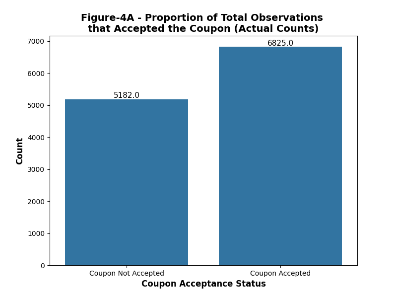
  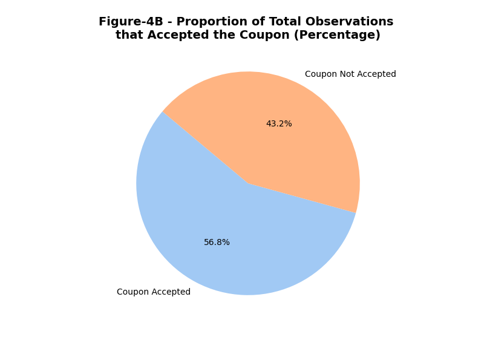

- Coupon type distribution and acceptance patterns
  - Coupon types are imbalanced (some types dominate). Raw-count analyses can be misleading without frequency normalization.
  - Example: restaurant (<20) and carry-away coupons represent large portions of the dataset.

  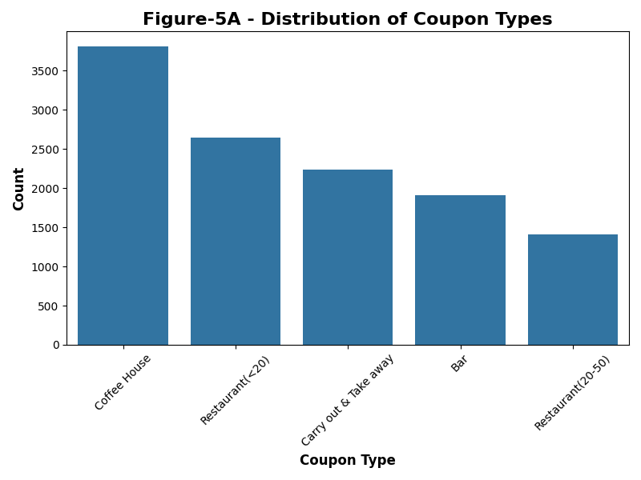
  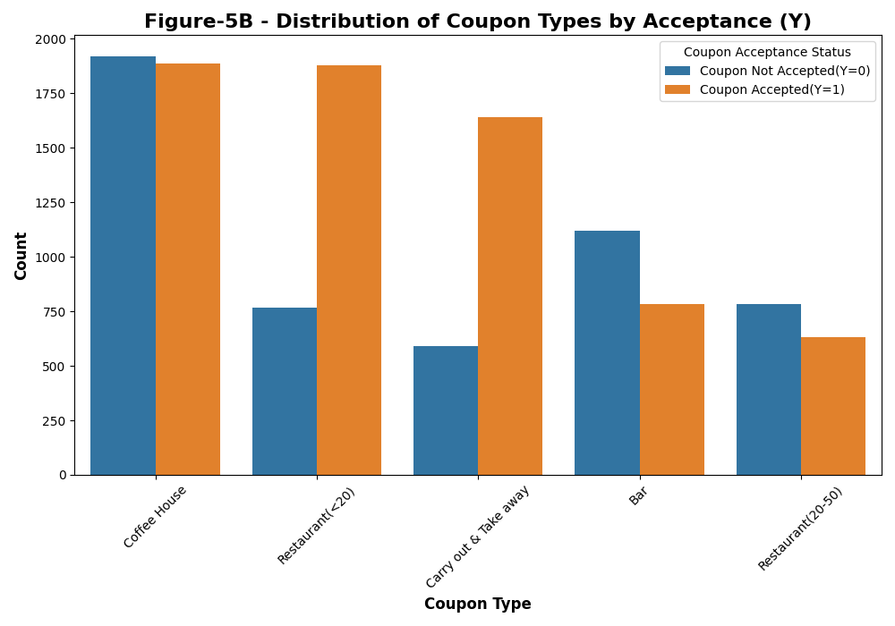

- Temperature
  - Temperature distribution is tri-modal and does not show a clear effect on coupon acceptance; not a major driver.

  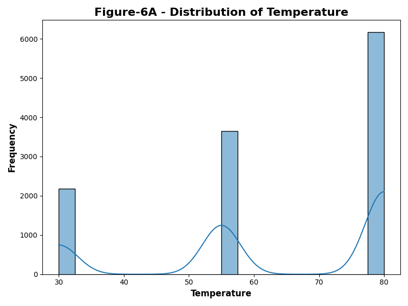
  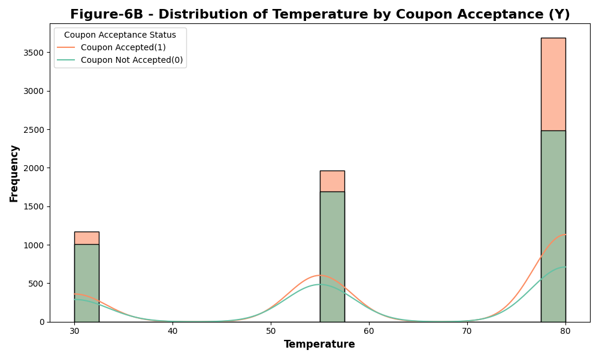

### Bar coupons (deep-dive)

- Overall: Bar coupons are less likely to be accepted — ~41.2% accepted vs 58.8% not accepted (Total bar coupons: 1,906).

  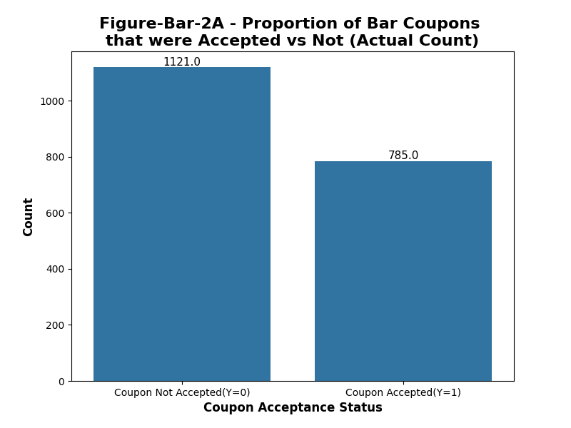
  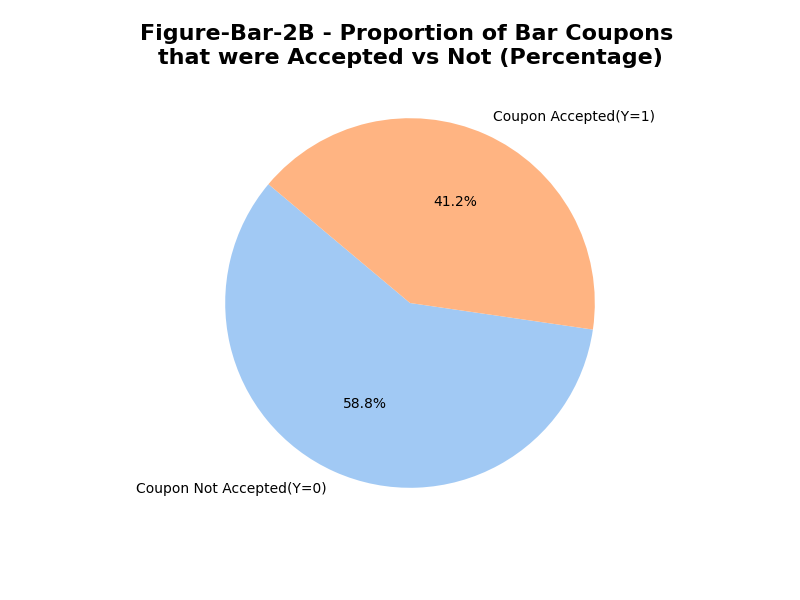

- Frequency matters strongly:
  - Bar visits <=3/month: acceptance ~37.2%.
  - Bar visits >3/month: acceptance ~76.2% (roughly double).

  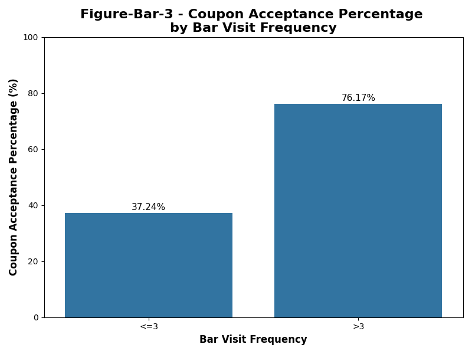

- Demographic segmentation:
  - Drivers ≥25 years old and who go to bars at least once/month: ~69% acceptance vs ~33.7% for others.
  - Drivers who go to bars ≥1/month, travel without kids, and are non-primary-industry workers show substantially higher acceptance — a clear target segment.

  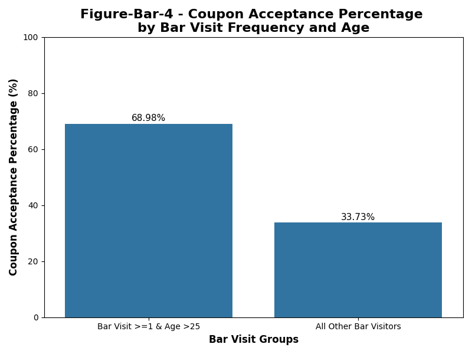
  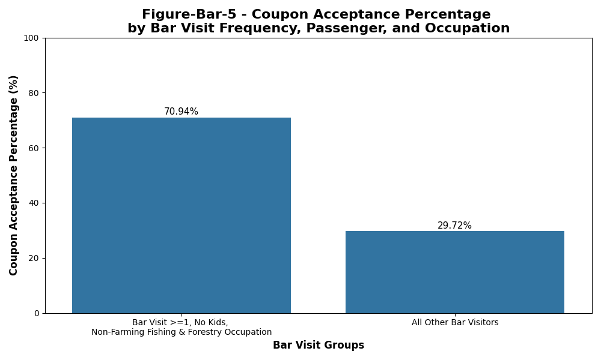

### Coffee-house coupons (deep-dive)

- Overall: acceptance split is near-even (small differences). The important signals arise in subgroup analyses.

  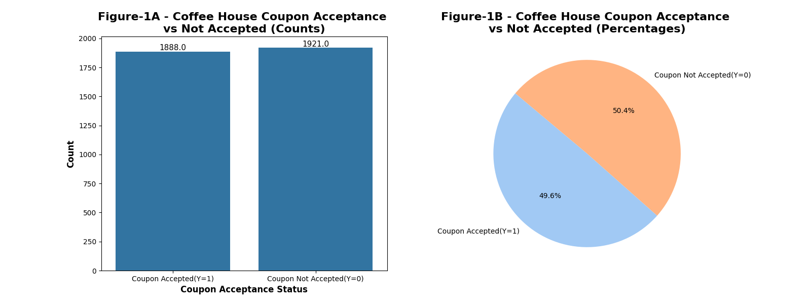

- Passenger-type & frequency interaction:
  - Acceptance increases with historical CoffeeHouse visit frequency (4~8, gt8 show higher acceptance).
  - Drivers traveling with `Partner` or `Alone` show highest acceptance; `Kid(s)` consistently shows the lowest acceptance.

  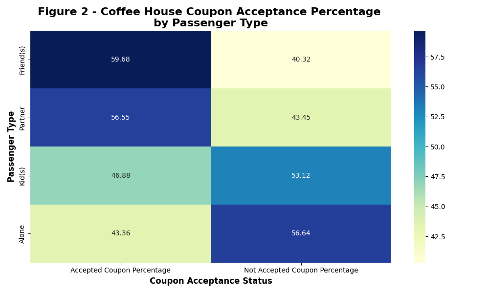
  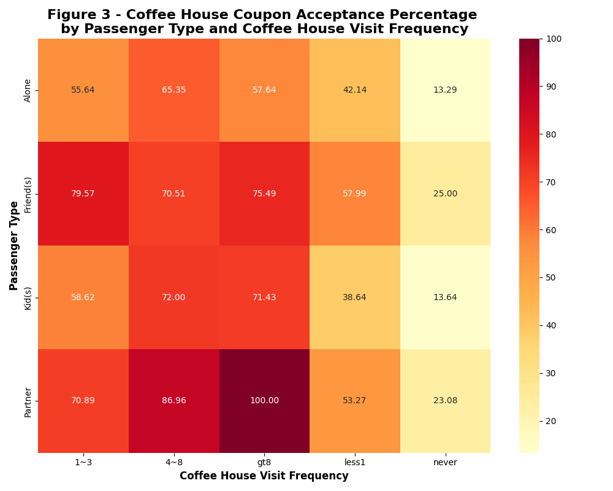

- Route & destination effects:
  - Acceptance increases when the coffee house lies on the same route as the trip (`direction_same == 1`).
  - Destination matters: discretionary/no-urgent destinations show higher acceptance than work/home when combined with favorable passenger types.

  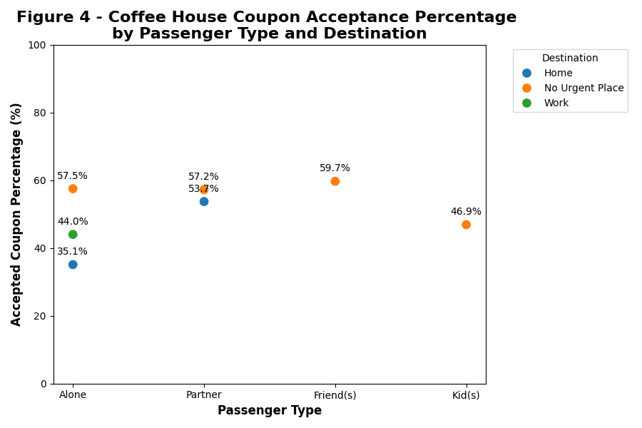
  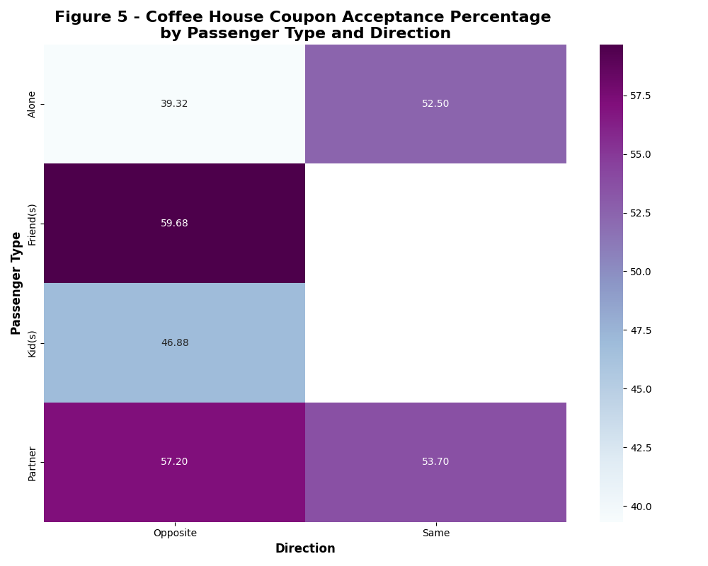
  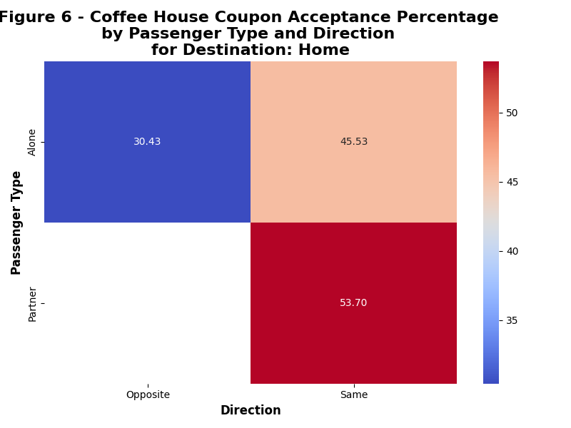

---

## Core Hypotheses

1. Behavioral persistence is the strongest predictor — coupons mainly reward existing behavior (frequent visitors), rather than creating new habitual behavior. Evidence: frequent bar- and coffee-house visitors accept coupons at a much higher rate.

2. Convenience matters — on-route offers (direction_same) significantly increase redemption probability because they reduce the marginal time and effort cost of detouring.

3. Family context reduces acceptance for some coupon types (bar & coffee) — presence of children reduces redemption likelihood.

4. Demographics and occupation proxy for lifestyle: urban/professional and middle-age groups (≥25) are higher-value targets for bar coupons.

5. Price-sensitivity and income: lower-income segments are more responsive to cheap-restaurant coupons; tailoring offer value matters by income bracket.

---

## Recommended Target User Profiles

- Primary bar-coupon target (high ROI):
  - Age: ≥25
  - Bar visit frequency: ≥1/month (highest returns when >3/month)
  - Passenger: Not traveling with kids
  - Occupation: Non-primary-industry (urban/professional)
  - Expected behavior: High intent to redeem; low-cost reminders and small perks suffice.

- Secondary coffee-coupon target (routine convenience):
  - Passenger: Alone or Partner
  - CoffeeHouse visit frequency: 4~8 or gt8
  - Direction: Same route to coffee shop
  - Expected behavior: Respond to route-aware, low-friction offers emphasizing convenience.

- Price-sensitive restaurant segment:
  - Income: <$50k
  - RestaurantLessThan20 frequency: high (4~8 or gt8)
  - Expected behavior: More responsive to discounted/cheap-restaurant offers.

---

## Practical Recommendations for Targeted Marketing

Below are practical, prioritized tactics to increase redemption while reducing wasted impressions.

1) Route-aware sending (high priority)
   - Only send location/reachability-based coupons when `direction_same == 1` (or predicted on-route). This increases redemption and reduces cost-per-redemption.
   - For coffee coupons, prefer push notifications that say: “On your way? Get a quick coffee — 20% off.”

2) Frequency-based tiering (high priority)
   - Segment by historical frequency (Bar / CoffeeHouse / Restaurant). For frequent users: low-friction, low-value offers suffice. For infrequent users: test higher-value/limited-time incentives.

3) Demographic targeting (medium priority)
   - For bar coupons: target age ≥25, traveling without kids, and urban/office occupations. Use creative that highlights social occasions rather than family-friendly messaging.

4) Value-personalization (medium priority)
   - Tailor discount size to income and frequency segment: smaller discounts for frequent users, larger for price-sensitive low-frequency segments.

---

## Caveats and Data Limitations

- Some subgroup cells have small sample sizes; percentages in those cells may be noisy and not generalizable.
- The notebook used utility heuristics (e.g., dropping `car` column) that were appropriate for this dataset but may remove some signal in other contexts.

---
